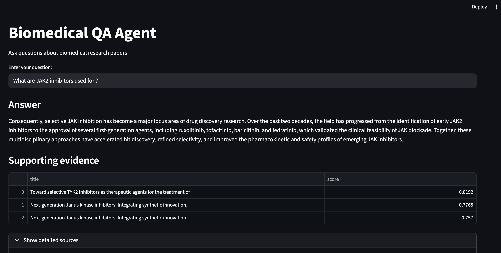

# Biomedical QA Agent (Lightweight RAG System)

**BioQAgent** is a biomedical question-answering (QA) agent designed to assist researchers and healthcare professionals in **exploring drug discovery literature**. 

This project implements a **Biomedical Question Answering (QA) system** built on top of PubMed abstracts.

The initial objective was to design a **Retrieval-Augmented Generation (RAG)** pipeline combining semantic search and LLM generation. However, due to hardware and cost constraints, the project evolved into a **lightweight, fully local and interpretable QA system**.

*This project is built with the support of AI-assisted tools as part of an active learning process in biomedical machine learning and software engineering. The goal is to accelerate exploration while maintaining full understanding of the underlying methods and implementations.*

## Pipeline

```
User query
   ↓
Semantic retrieval (SentenceTransformers)
   ↓
Top-k relevant abstracts
   ↓
Sentence-level ranking
   ↓
Extractive answer
```

## Data

**Source: PubMed abstracts**
Size: ~2,000 documents
Processing:
- cleaning (title + abstract)
- embedding generation using `all-MiniLM-L6-v2`

```bash
# Set email (NCBI requirement)
export ENTREZ_EMAIL="your_email@example.com"

# Fetch the raw data
python scripts/download_data.py

# Run the preprocessing
python scripts/preprocess_data.py

# Generate embeddings
python scripts/build_embeddings.py
```

## Retrieval system

**Model: SentenceTransformers** (`all-MiniLM-L6-v2`)
**Similarity: Cosine similarity** (sklearn)
Output: Top-k most relevant abstracts

## Evaluation

To assess retrieval quality, multiple metrics were used:
- **Precision** at k=5
- **Reciprocal Rank (MRR)**
- **Ranking gap** (confidence signal)

## QA agent prototype

### LLM-based QA Agent

This project **initially aimed** to implement a full Retrieval-Augmented Generation **(RAG) pipeline**, combining semantic retrieval with **LLM-based** answer generation.

**Implementations** considered or tested:

1. OpenAI API:
- Successfully designed the integration
- Not executed due to lack of API key and billing setup
- **Option discarded** to maintain a **fully free and reproducible project**

2. **Local LLMs with Ollama**

Tested models: `llama3` and `phi3`

While the integration was technically successful, execution revealed **major limitations** including an **extremely slow inference**, **high CPU usage** (100%) and **system instability**.

**Limitation**: due to hardware constraints (CPU-only environment), the LLM-based QA system could not be executed reliably.

As a result: generated answers could not be evaluated and the **RAG pipeline could not be validated end-to-end**.

The **full implementation of the LLM-based QA agent** based on **Ollama phi3 model** is **still included in this repository** in the experimental/LLM_QA/ folder (python module and notebook)
*Note: this code is provided for completeness but was not fully executed due to the limitations described above.*

### Final approach: lightweight QA Agent

Given these previously mentionned constraints, the **lightweight extractive QA approach** implemented provides a **strong tread-off between performance and interpretability**. 

#### Method

- Retrieve top relevant abstracts
- Split abstracts into sentences
- Rank sentences using embedding similarity
- Return top-ranked sentences as answer

#### Limitations

- Extractive approach: no true generative reasoning
- Limited paraphrasing capability
- Keyword-based evaluation (approximate relevance)
- Small dataset (~2k abstracts)

#### App

A simple interactive demo is available via Streamlit:

```bash
streamlit run app/streamlit_app.py
```



## Future work

- Extended validation of the performances (e.g. more test queries)
- Expand the dataset (larger biomedical corpora)
- Deploy as a web application

*Optional: implement an LLM-based generation (RAG) using cloud computing resources (main limitation: cost)*

## Note

Parts of this project were **developed with the assistance of AI tools** to accelerate prototyping and explore different architectural approaches.

All design decisions, evaluation strategy, and implementation choices were critically reviewed and adapted.
